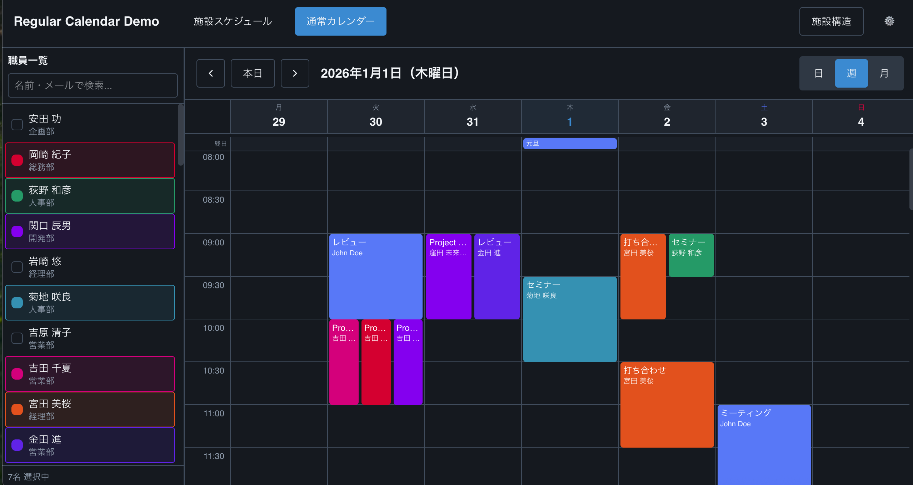

# regular-calendar 📅

A generic, high-performance facility schedule management component for React.
Designed to be domain-agnostic, customizable, and easy to integrate with any backend.


[](https://www.npmjs.com/package/regular-calendar)

**npm**: https://www.npmjs.com/package/regular-calendar

## Screenshots 📸

| Facility Schedule | Regular Calendar |
|-------------------|------------------|
|  |  |

## Features 🚀

- **Generic & Domain-Agnostic**: Manage generic "Resources" (beds, rooms, machines) and "Events". No baked-in business logic.
- **Multiple Views**: Seamlessly switch between **Day**, **Week**, and **Month** views.
- **Interactive Scheduling**: 
  - Drag & Drop support (powered by `@dnd-kit`).
  - Resizable events.
  - One-click slot creation.
- **Performance**: Virtualized rendering for handling large numbers of resources.
- **Customizable**: Inject your own Event Modal or use the built-in simplified form.
- **Zero External Styles**: Uses locally scoped generic UI components for maximum portability.

## Installation 📦

```bash
pnpm install regular-calendar
```

### Peer Dependencies
Ensure you have the following installed (versions should match your app):

```bash
pnpm install react react-dom date-fns i18next react-i18next
```

## Quick Start 🏃‍♂️

1. **Import the component and styles**:

```tsx
import { FacilitySchedule } from 'regular-calendar';
import 'regular-calendar/styles'; 
```

2. **Render the schedule**:

```tsx
import { useState } from 'react';
import { FacilitySchedule } from 'regular-calendar';
import 'regular-calendar/styles';

function App() {
  const [events, setEvents] = useState([
    {
      id: 'e1',
      resourceId: 'r1',
      title: 'Meeting',
      startDate: new Date('2024-01-01T09:00:00'),
      endDate: new Date('2024-01-01T10:00:00'),
      color: '#3b82f6'
    }
  ]);

  const resources = [
    { id: 'r1', name: 'Room A', groupId: 'g1', order: 1 }
  ];

  const groups = [
    { id: 'g1', name: 'Conference Center' }
  ];

  return (
    <div style={{ height: '100vh' }}>
      <FacilitySchedule
        events={events}
        resources={resources}
        groups={groups}
        settings={{
            weekStartsOn: 1, // Monday
            startTime: '08:00',
            endTime: '18:00',
            defaultDuration: 60,
            closedDays: [0], // Sunday
        }}
        onEventCreate={(data) => console.log('Create:', data)}
        onEventUpdate={(id, data) => console.log('Update:', id, data)}
        onEventDelete={(id) => console.log('Delete:', id)}
      />
    </div>
  );
}
```

### RegularCalendar (compact calendar without resources)

```tsx
import { RegularCalendar } from 'regular-calendar';
import 'regular-calendar/styles';

function App() {
  return <RegularCalendar />;
}
```

## API Reference 📚

### `FacilitySchedule` Props

| Prop | Type | Description |
|------|------|-------------|
| `events` | `ScheduleEvent[]` | Array of event objects to display. |
| `resources` | `Resource[]` | Array of resources (rows/columns). |
| `groups` | `ResourceGroup[]` | Optional grouping for resources. |
| `settings` | `FacilityScheduleSettings` | Configuration for time ranges, grid size, etc. |
| `isLoading` | `boolean` | Shows a loading state if true. |
| `className` | `string` | Additional CSS classes for the container. |
| `components` | `{ EventModal?: React.ComponentType }` | Inject custom components (e.g. your own Event creation modal). |

### Callbacks

| Callback | Signature | Description |
|----------|-----------|-------------|
| `onEventCreate` | `(data: EventFormData) => void` | Called when a new event is saved. |
| `onEventUpdate` | `(id: string, data: EventFormData) => void` | Called when an existing event is edited. |
| `onEventDelete` | `(id: string) => void` | Called when an event is deleted. |
| `onEventClick` | `(event: ScheduleEvent) => void` | Called when an event bar is clicked. |
| `onDateChange` | `(date: Date) => void` | Called when the current view date changes. |

### Data Types

**ScheduleEvent**
```typescript
interface ScheduleEvent {
  id: string;
  resourceId: string;
  title: string;
  startDate: Date;
  endDate: Date;
  color?: string;
  // ... other optional fields
}
```

**Resource**
```typescript
interface Resource {
  id: string;
  name: string;
  groupId: string;
  order: number;
}
```

### Configuration (Settings)

The `settings` prop controls the calendar's behavior and constraints.

```typescript
type FacilityScheduleSettings = {
  // Business Hours
  startTime: string;   // e.g. "09:00"
  endTime: string;     // e.g. "18:00"

  // Grid Configuration
  defaultDuration: number; // Default event duration in minutes (e.g., 60)
  
  // Holidays / Closed Days
  closedDays: number[]; // 0=Sunday, 1=Monday, etc.

  // Display
  weekStartsOn: 0 | 1;  // 0=Sunday, 1=Monday
  timeZone?: string;    // e.g. "Asia/Tokyo"
  
  // Custom Time Slots (optional override)
  timeSlots?: Array<{
    id: string | number;
    label: string;
    startTime: string;
    endTime: string;
  }>;
};
```

### Internationalization (i18n) 🌍

This library uses `react-i18next`. If you do nothing, it falls back to **English** labels.
If you want multiple languages, initialize `i18next` in your app and provide the keys you need.

```json
{
  "loading": "Loading...",
  "today_button": "Today",
  "view_day": "Day",
  "view_week": "Week",
  "view_month": "Month",
  "event_modal_title_create": "New Schedule",
  "event_modal_title_edit": "Edit Schedule",
  "title_label": "Title",
  "attendee_label": "Attendee",
  "resource_label": "Resource",
  "date_label": "Date",
  "time_label": "Time",
  "save_button": "Save",
  "delete_button": "Delete",
  "cancel_button": "Cancel",
  "confirm_delete_title": "Delete Schedule",
  "confirm_delete_message": "Are you sure you want to delete this schedule?"
}
```

Ensure your `i18n` instance is initialized before rendering the component when using multiple languages.

## Full Stack Example 🏗️

Check out the `examples/` directory for a complete Full-Stack implementation using **Bun**, **Hono**, **SQLite**, and **React**.

- **Backend**: `examples/backend` (Bun + Hono + SQLite + Drizzle ORM)
- **Frontend**: `examples/frontend` (React Component with data fetching)

See [Walkthrough](./examples/README.md) (or simply explore the folder) for details on how to run it.

## Customization 🎨

### Tailwind Integration 🌬️

If you are using Tailwind CSS, you can use our preset to inherit all theme variables and utility classes.

1.  **Update `tailwind.config.js`**:

```javascript
import regularCalendarPreset from 'regular-calendar/tailwind-preset';

export default {
  presets: [regularCalendarPreset],
  content: [
    // ... your app content
    './node_modules/regular-calendar/dist/**/*.{js,ts,jsx,tsx}'
  ],
  // ...
};
```

This makes all `regular-calendar` utility classes (like `bg-primary`, `text-foreground`) available in your app, ensuring perfect visual consistency.

### Theme Configuration

`regular-calendar` uses CSS variables for all styling. You can customize the look and feel by overriding these variables in your CSS.

#### 1. Setup Theme Provider

Use the `ThemeProvider` to control high-level settings like density and border radius.

```tsx
import { FacilitySchedule, ThemeProvider } from 'regular-calendar';
import 'regular-calendar/styles';

function App() {
  return (
    <ThemeProvider config={{
      density: 'compact',    // 'compact' | 'normal' | 'spacious'
      radius: 0.5,           // Border radius in rem
      tabletMode: false,     // Enable touch-optimized UI
    }}>
      <FacilitySchedule ... />
    </ThemeProvider>
  );
}
```

#### 2. CSS Variables (Theming)

You can globally override colors and layout metrics in your main CSS file. We support **Dark Mode** out of the box via the `.dark` class.

```css
:root {
  /* --- Layout Metrics --- */
  --radius: 0.5rem;
  --ui-font-size-base: 0.875rem;
  --ui-component-height: 2.5rem;  /* Height of inputs, buttons */
  
  /* --- Colors (HSL values) --- */
  --primary: 221 83% 53%;         /* Main Brand Color */
  --primary-foreground: 210 40% 98%;
  
  --background: 0 0% 100%;        /* Page Background */
  --foreground: 222 47% 11%;      /* Main Text */
  
  --muted: 210 40% 96.1%;         /* Secondary Backgrounds */
  --muted-foreground: 215 16% 47%;
  
  --border: 214 32% 91%;          /* Borders */
  --input: 214 32% 91%;           /* Input Borders */
  
  --accent: 210 40% 96.1%;        /* Hover/Active States */
  --accent-foreground: 222 47% 11%;
}

/* Dark Mode Overrides */
.dark {
  --background: 222 47% 11%;
  --foreground: 210 40% 98%;
  
  --primary: 217 91% 60%;
  --primary-foreground: 222 47% 11%;
  
  --muted: 217 33% 17%;
  --muted-foreground: 215 20% 65%;
  
  --border: 217 33% 17%;
  --input: 217 33% 17%;
}
```

### Custom Modal
You can replace the default event creation modal with your own by passing a component to the `components` prop.

```tsx
<FacilitySchedule
  // ...
  components={{
    EventModal: MyCustomModal
  }}
/>
```

## Development & Contributing 🛠️

Please read [CONTRIBUTING.md](./CONTRIBUTING.md) for details on our code of conduct, and the process for submitting pull requests.

```bash
# Install dependencies
pnpm install

# Run tests (Vitest)
pnpm test

# Build the library
pnpm run build

# Type Checking
pnpm run type-check
```

## License

MIT
